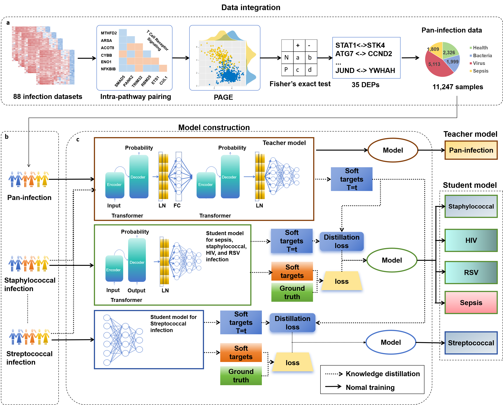
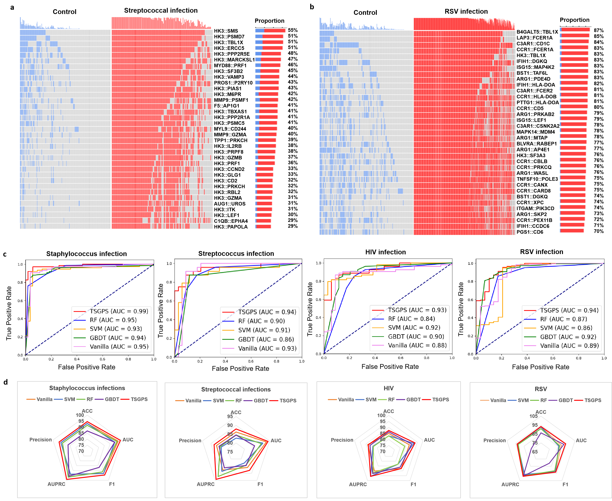
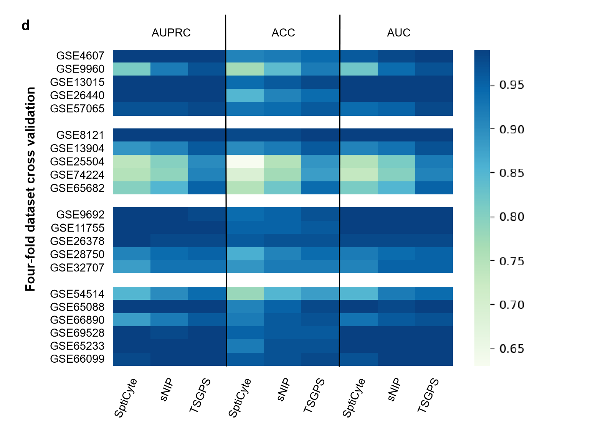

# TSGPS: Pan-Infection Foundation Framework for Pathogen Prediction

## 📌 Introduction
This repository implements the **TSGPS** framework described in the paper “Pan-Infection Foundation Framework Enables Multiple Pathogen Prediction.” By pre-training the Pan-Infection Foundation Model (PIFM), this framework achieves cross-species prediction capabilities for multiple pathogens, making it suitable for biomedical research, infectious disease surveillance, and precision medicine applications.



## 🔬 Core Functionality
- **Data Preprocessing**: Generate gene pair data required for training using `data_process_PAGE.py`
- **PIFM/vanilla model Training**: Train the PIFM base model via `simple_train.py`. Train the vanilla model base model via `Student.py`. 
- **Konwledge Distillation Application**: Implement pathogen prediction within the TSGPS framework using `distillation.py`

## 🛠 Installation Guide
### Environment Setup
```
# Install dependencies（Python 3.8+）
pip install -r requirements.txt
```
### Dependency Statement
- PyTorch 2.0+: Requires CUDA toolkit
- GPU Acceleration: NVIDIA GPUs (Tesla V100 or higher) recommended

## 🚀 How to use

Data Process

You can use data_process_PAGE.py to perform preliminary data processing to obtain gene pairs for training the model.
```
python data_process_PAGE.py
```

Training PIFM/Vanilla model

You can run simple_train.py to train Pan-Infection Foundation Model (PIFM). Then run Student.py to get vanilla model.
```
python simple_train.py
python Student.py
```
Use TSGPS

You can run distillation.py to train a student model with the knowledge from PIFM.
```
python distillation.py
```

The model will be saved in the result folder

## 📊 Output figure
Training Process Generation:
- loss.png: Training Loss Curve
- acc.png: Training accuracy Curve

Prediction results include:
- roc.png: ROC curve

## 🔬 Result of TSGPS
- The performance of Student model using TSGPS.


- The performance of TSGPS using in Sepsis. Using cross validation.


## 🤝 贡献指南
In this study, we harnessed KD and pan-infection data for multiple pathogen prediction and infection-related disease diagnosis. After curating an integrated pan-infection dataset of over ten thousand samples, we used a coarse-to-fine teacher-student architecture based on KD and defined it as Teacher-Student Gene Pair Signature (TSGPS), which reduces the number of parameters of the model while improving prediction accuracy and facilitating clinical deployment. TSGPS can simultaneously and precisely diagnose six infections, including pan-infection, staphylococcal infection, streptococcal infection, HIV, RSV, and sepsis. 

